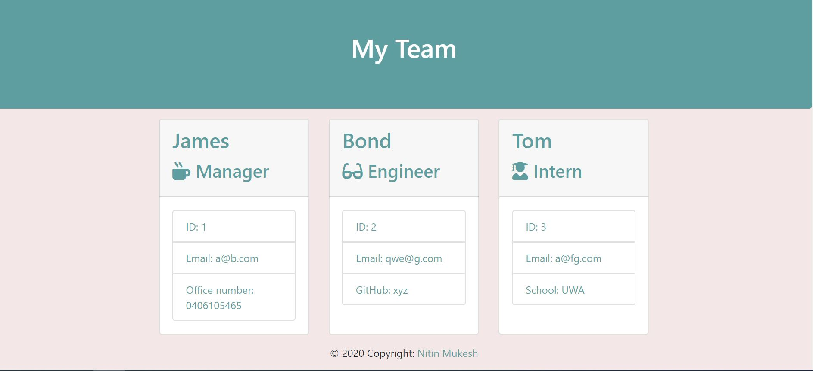

# Team Profile Generator

## Description
It is a command line application to generate software engineering team profile. The application will prompt the user for information about the team manager and then information about the other team members. The user can enter any number of team members. When the user has completed building the team, the application will create a team.html file in output folder in current directory. if output folder is not present, then it will be created.
## Table of Contents
* [Installation](#installation)
* [Usage](#usage)
* [License](#license)
* [Contributing](#contributing)
* [Tests](#tests)
* [Questions](#questions)
## Installation
please download the repository, install node.js and run npm install command from terminal.
## Usage
It can be used to generate an html rendering all team members essential details in one place so that one can access those details easily.
## Contributing
You are most welcome to contribute. There are various ways to do same:
1. Raise a pull request.
2. Raise a new feature request.
3. Raise a defect request.
## Tests
Please run node app.js command from terminal and then check output folder for team.html file. you may check this [video](https://drive.google.com/file/d/1foqJXOMC6dGj2zjwA4WdYYOl6Mm8JzlW/view) as well to see a sample application execution.
## Screenshot

## License
This application is not covered under any license currently
## Questions
* Please raise a request at [github](https://github.com/nitinmuk)